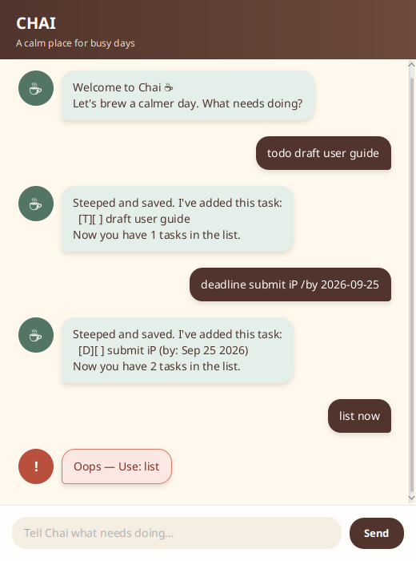

# Chai

Chai is a calm desktop task companion for keeping todos, deadlines, and events in one place. It uses a concise command interface, saves every change automatically, and keeps its data in a human-editable text file.



## Quick start

1. Install Java 25.
2. Download `chai.jar` from the [latest GitHub release](https://github.com/joash-chen/ip/releases).
3. Open a terminal in the folder containing the JAR.
4. Run `java -jar chai.jar`.

Chai creates `data/chai.txt` beside the JAR when it first needs to save a task. If the file or folder does not exist yet, Chai creates it automatically.

## Commands

### Add a todo

Use `todo DESCRIPTION` for a task without a date.

```text
todo borrow book
```

### Add a deadline

Use `deadline DESCRIPTION /by DATE`. Dates use the `yyyy-MM-dd` format.

```text
deadline submit report /by 2026-09-25
```

### Add an event

Use `event DESCRIPTION /from START_DATE /to END_DATE`.

```text
event project meeting /from 2026-09-20 /to 2026-09-21
```

### View and update tasks

| Command | Result |
| --- | --- |
| `list` | Shows every task. |
| `mark NUMBER` | Marks the numbered task as complete. |
| `unmark NUMBER` | Marks the numbered task as incomplete. |
| `delete NUMBER` | Permanently removes the numbered task. |
| `find KEYWORD` | Finds descriptions containing the keyword, ignoring case. |
| `sort` | Orders events by start date and deadlines by due date, followed by todos. |
| `bye` | Closes Chai. |

Task numbers come from the latest `list`, `find`, or `sort` output. Sorting changes and saves the main task order.

## Handling errors

Chai explains malformed commands without closing the app. For example, entering `deadline submit report /by tomorrow` explains that the date must use `yyyy-MM-dd`. If saved data is missing, Chai starts with an empty list; if it is corrupted or cannot be read, Chai reports the problem and starts a safe empty session.

## Data portability

The save file is plain text and can be opened in any text editor. Keep the `data` folder together with the JAR when moving an existing task list to another computer.

## Credits

Chai was created by Joash Chen for the NUS CS2103T individual project. It began from the [course iP starter repository](https://github.com/NUS-CS2103-AY2627-S1/ip), and its JavaFX structure follows the [SE-EDU JavaFX tutorial](https://se-education.org/guides/tutorials/javaFxPart1.html). The Chai visual styling, task features, and written content are original to this project.
